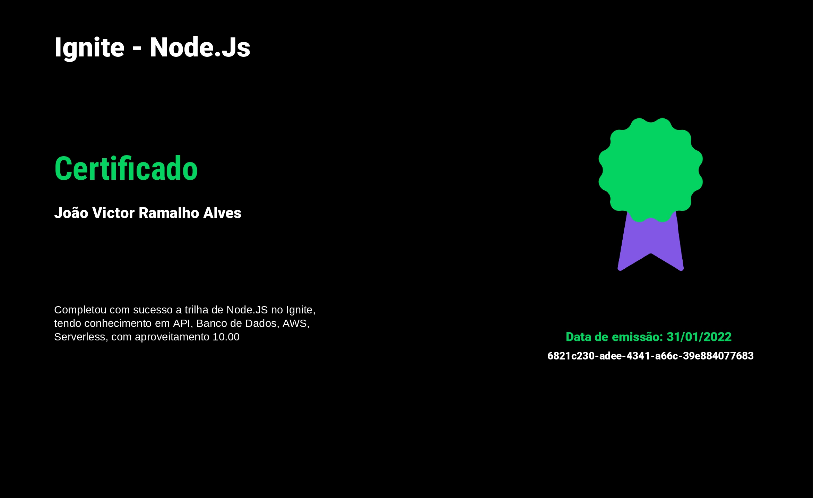

<h1 align="center">🧑‍🎓 Gerador de certificados</h1>

 
    

## ✨ Tecnologias

Esse projeto foi desenvolvido com as seguintes tecnologias:

- [Node.js](https://nodejs.org/en/)
- [Typescript](https://www.typescriptlang.org/)
- [Serverless Framework](serverless.com/)
- [Amazon Lambda](https://aws.amazon.com/pt/lambda/)

## 💻 Projeto

O projeto tem como responsabilidade gerar um certificado para um usuário e a possibilidade de pesquisar a validade de um certificado.

## 🚀 Como executar

- Clone o repositório

### Para rodar localmente

- Rode `yarn` para instalar as dependências
- Rode `serverless dynamodb install` para baixar o DynamoDB localmente.
- Rode `yarn dynamo:start` para iniciar o banco de dados em ambiente local.
- Rode, em outro terminal, o `yarn dev` para iniciar a aplicação em ambiente local.

### Para fazer o deploy

- Configurar as credenciais do usuário
- Rode `yarn deploy` para subir o projeto para AWS Lambda

## 📄 Licença

Esse projeto está sob a licença MIT. Veja o arquivo [LICENSE](LICENSE.md) para mais detalhes.
